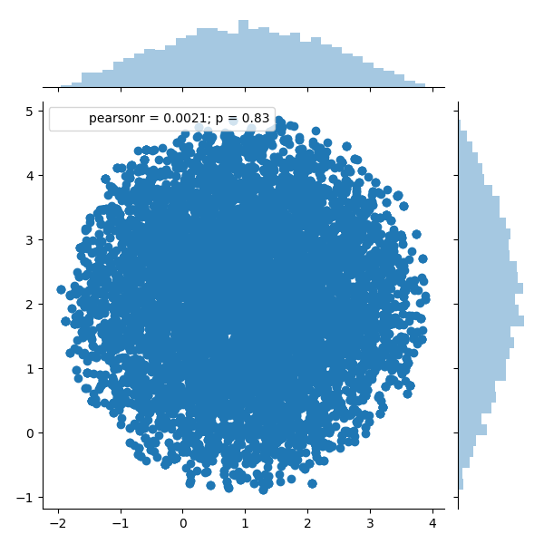
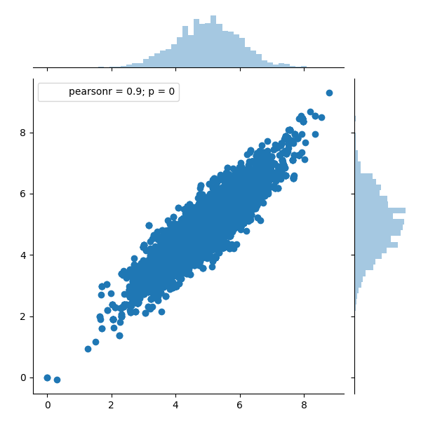

## [Metropolis Hastings](https://en.wikipedia.org/wiki/Metropolis%E2%80%93Hastings_algorithm)

x is 1th dimension, y is 2th dimension, the jumping function g(m^{(t+1)}|m^{(t)}) is a standard Gaussian distribution centered at m^{(t)}, so that points closer to m^{(t)} are more likely to be visited next—making the sequence of samples into a random walk.

#### circle

#### gaussian

