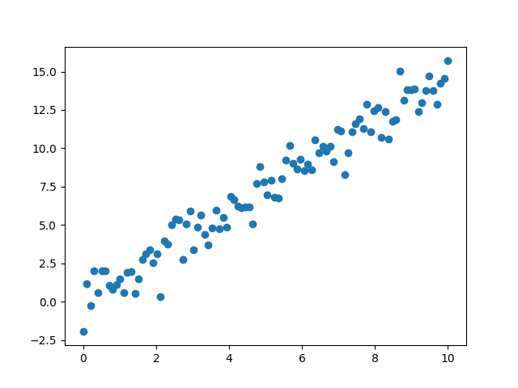

## [Stochastic Gradient Langevin Dynamics](https://www.stats.ox.ac.uk/~teh/research/compstats/PatTeh2013a.pdf) 

[https://www.stats.ox.ac.uk/~teh/research/compstats/sgld.pdf](https://www.stats.ox.ac.uk/~teh/research/compstats/sgld.pdf)

