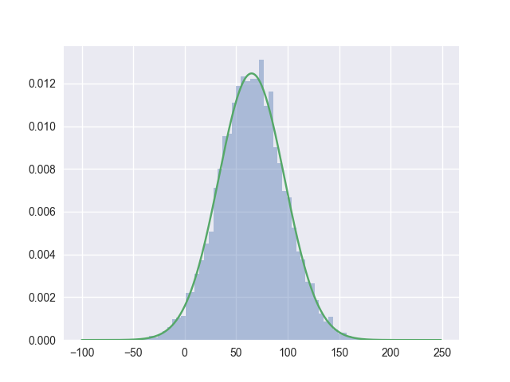

## [Slice Sampling](https://en.wikipedia.org/wiki/Slice_sampling) 

 This can be visualized as alternatively sampling the y-position and then the x-position of points under pdf, thus the Xs are from the desired distribution. The  Y values have no particular consequences or interpretations outside of their usefulness for the procedure.

**Notice: this example only considers 1D normal distribution**

